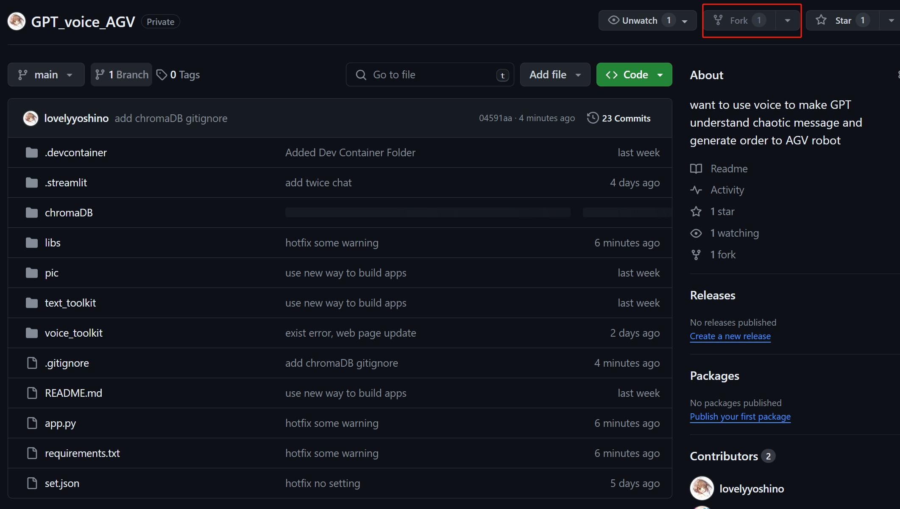
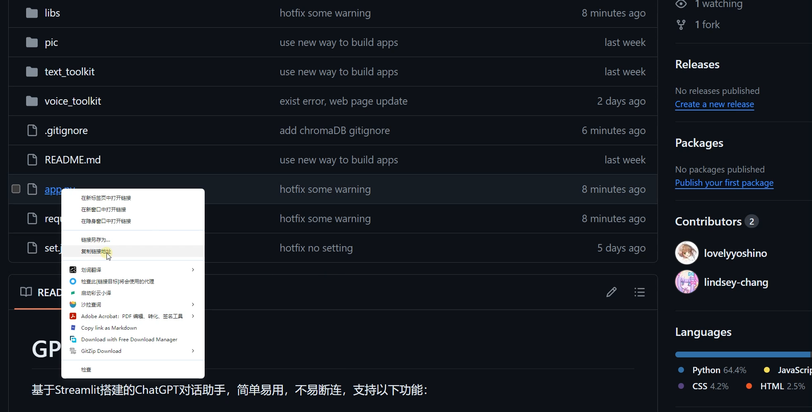
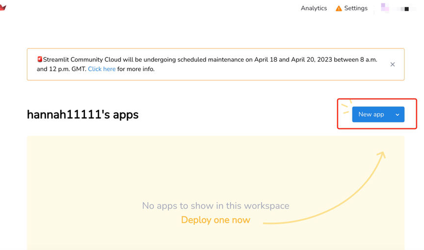
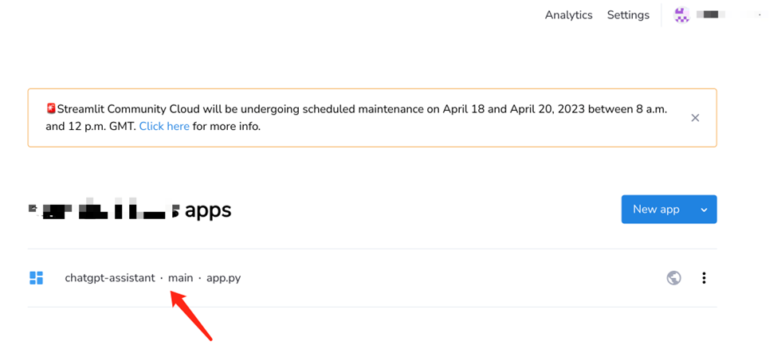
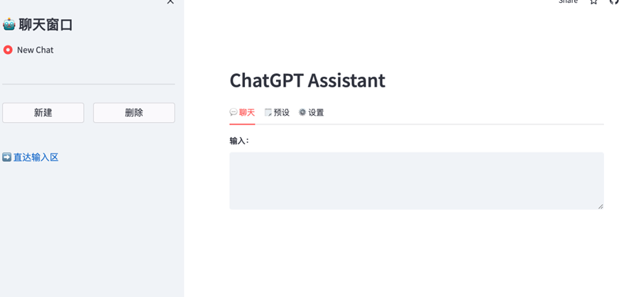
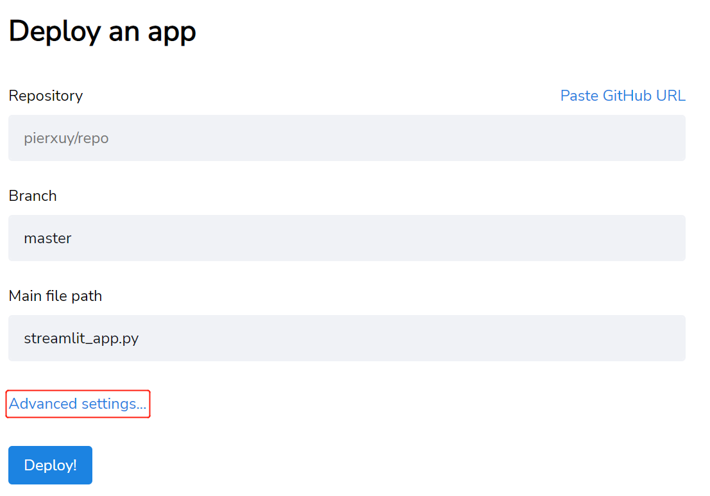
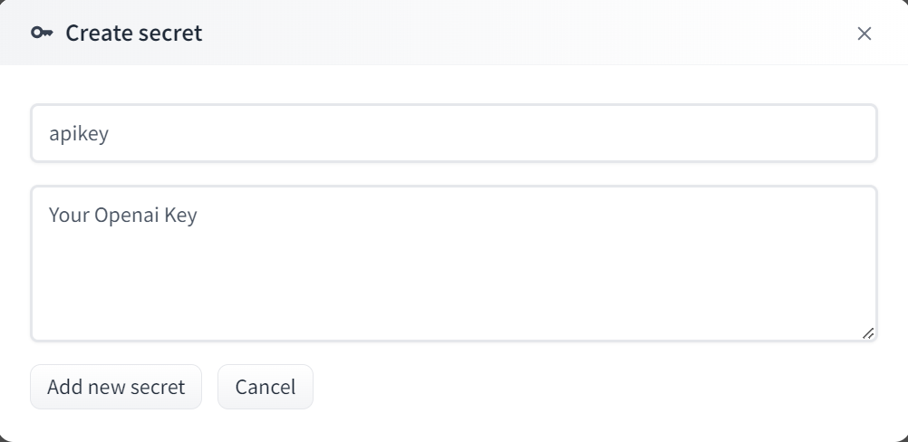

# GPT_voice_AGV

基于Streamlit搭建的ChatGPT对话助手，简单易用，不易断连，支持以下功能：
- 多聊天窗口
- 历史对话留存
- 预设聊天上下文 
- 模型参数调节
- 对话导出为Markdown文件
- ChatGPT语音交流（推荐电脑端Edge浏览器）
- hand-free无需手动交流
- 支持多次循环访问
- 支持RAG模型来实现本地数据库

### 使用技巧：
- 双击页面可直接定位输入栏
- Ctrl + Enter 可快捷提交问题

# 部署云端

#### 1. 上传到个人Github仓库

---



#### 2. 复制个人仓库app.py链接地址

---



#### 3. 注册[Streamlit](https://share.streamlit.io/)后准备部署

---


---

#### 4. 粘贴app.py链接地址，开始部署

---


---


---




## Streamlit Cloud部署（推荐）

1. `Fork`本项目到个人Github仓库。
2. 注册[Streamlit Cloud账号](https://share.streamlit.io/)，并连接到Github。
3. 开始部署应用，具体可参考[官方教程](https://docs.streamlit.io/streamlit-community-cloud/get-started)。
4. 在应用的Secrets中配置Openai Key以及proxies/apibase（两个必须有其中一个），具体格式参考下图：






## 本地部署

1. 建立虚拟环境（建议）

2. 克隆项目（也可以手动下载到本地）
```bash
git clone https://github.com/lovelyyoshino/GPT_voice_AGV.git
```

3. 安装依赖
```bash
pip install -r requirements.txt
```

4. 设置API Key;设置API Base（可选）

- 在 `.streamlit/secrets.toml`文件中写入`apikey = "Openai Key"`
- 在 `.streamlit/secrets.toml`文件中写入代理接口即可实现免科学使用，格式为`apibase = "代理接口地址"`，说明如下：   
  1. 可以直接使用项目[openai-forward](https://github.com/beidongjiedeguang/openai-forward)已搭建的代理接口，即`apibase = "https://api.openai-forward.com/v1"` 。
  2. 可参考[openai-forward](https://github.com/beidongjiedeguang/openai-forward)项目自行搭建代理接口并进行设置。

5. 启动应用
```bash
streamlit run app.py
```

# 说明

- 在custom.py文件中可自定义用户名和SVG格式头像[(来源)](https://www.dicebear.com/playground?style=identicon)。
- 在部署的项目源码中编辑set_context.py，即可增加预设定的上下文选项，会自动同步到应用中。
- 有条件的可以考虑把helper.py中的文件读写逻辑改为云数据库操作，防止历史记录丢失。
